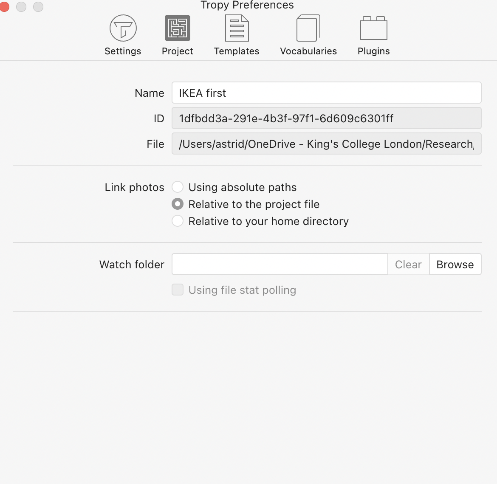

```{r setup, include=FALSE}
knitr::opts_chunk$set(echo = TRUE)

# Important: https://forums.tropy.org/t/importing-notes-via-jsonld/1680/2
# Useful: https://themockup.blog/posts/2020-05-22-parsing-json-in-r-with-jsonlite/
# https://moz.com/blog/json-ld-for-beginners
# http://www.linkeddatatools.com/introduction-json-ld


## TO TROUBLESHOOT
# Currently images without a tag will not import (at least if other images do have a tag) 
# Workaround is to make sure that all images are assigned a tag (I did "test_tag" on all upon first export from Tropy)
# 

```


## Abstract

This lesson is intended for [Tropy](https://tropy.org/) users who want to move metadata and annotations associated with their image collections in Tropy for analysis in  R. 

Tropy is a free tool that specialises in the management and annotation of large image collections (e.g., photographs taken in an archive). After managing your collection in Tropy, you might want to analyse your annotations (e.g., tags, selections, metadata, or notes) in R. This lesson takes you through the steps of understanding the structure of Tropy collections, exporting your collection in JSON-LD, and extracting the relevant data in R, ready for further manipulation and analysis.

## Case Study Description
Historians who work with large sets of image collections (e.g., photographs of archival materials, digitised manuscripts, digitised newspapers and magazines) might benefit from a workflow that integrates their photo management software (such as Tropy) with tools that allow for bird's eye oversight of these collections and the scholar's annotations. I started going back-and-forth between Tropy and R to do just that: in a project about the representation of money and markets in children's picturebooks, for example, I used Tropy to annotate, tag, and create selections of hundreds of picturebook pages. I then exported this collection for analysis in R, gaining insight over frequently co-occurring tags, where tags tend to occur within a narrative, patterns in keywords over time, narrative structure, and more.

With sufficient knowledge of the structure of JSON-LDs and Tropy collections, this workflow can be adapted to any image collection. For this lesson, I propose making use of IKEA catalogues (recently made available on their [museum website](https://ikeamuseum.com/sv/ikea-kataloger/) and the [Internet Archive](https://archive.org/download/swedish-ikea-catalogs-1950-2021)) for demonstration purposes.

Some of the features described above are available in costly qualitative data analysis software such as NVivo or Atlas.TI - I propose an alternative workflow that is free and adaptable to the researcher's needs. 


## The dataset

We'll make use of the IKEA catalogues, which have recently been made available through [the IKEA Museum](https://ikeamuseum.com/en/digital/ikea-catalogues-through-the-ages/) and the [Internet Archive](https://archive.org/download/swedish-ikea-catalogs-1950-2021)).

The catalogues can all be downloaded in one go by finding the 'Download Options' box (to the right of the metadata, underneath the image viewer) and choosing the desired format. We'll be working with the PDF files. Note that the download is 11.2GB!

Once we're ready, we'll make sure that we have all our PDF files in one folder, and know where to find them.

## Setup

### Tropy Project

Start by opening Tropy and creating a Project... For this tutorial, we'll set the template for new items to Dublin Core (but you can adapt this for any other template). We'll also change the settings (Link photos) so that file paths are set as relative to the project file.

`Tropy > Preferences > Settings`


`Tropy > Preferences > Project > Link photos`



We're now ready to import our catalogues into Tropy. The easiest way is to drag and drop the PDF files into the main screen. This might take a while if you're importing them all at once. 

We could manually add the metadata for each catalogue; Tropy has an easy-to-use and intuitive interface, so this wouldn't be too much of a hassle to do. That said, we can also speed up the process by preparing a JSON-LD file that contains all the metadata info we need. This is where we'll start making use of R.

[JSON-LD](https://json-ld.org/) is...

Our first step will be to decide which metadata fields we'll want to manipulate in R. We can add fields further down the line, but it's easiest to get started with one example. For example, we'll fill in the following details:


We can now export the current project in JSON-LD format. !! Important: `Ctrl + A` or `Cmd + A` to select all the items in your project.

`File > Export > JSON-LD`

Save this as `metadata.json` in the project folder.


### Populating the JSON-LD file with metadata

Open RStudio, create a new project. Load libraries.

```{r load libraries}
library(tidyverse)
library(jsonlite)
```

We'll read in the JSON file.

```{r json}
metadata <- fromJSON("metadata.json")

#Let's look at the structure. We set the level to '2' so that we can see two levels in
str(metadata, max.level = 2)
```

[Brief explanation of what's recorded in the JSON file, and why we set some of the metadata in Tropy initially.]

We're mostly interested in the data in `@graph`. We can extract it into its own data frame by  subsetting the list with `$` or `[[`.

```{r json to dataframe}
metadata_graph <- metadata[["@graph"]] # equivalent to metadata$`@graph`

str(metadata_graph, max.level = 2)
```

Now we can add some metadata:

```{r add metadata}
# Get the publication year from the file title
metadata_graph <- metadata_graph %>%
  extract(col = title, into = "date", regex = "([0-9]{4})", remove = FALSE) # quick glance tells us the regex can be quite simple 

# Add some more metadata
metadata_graph <- metadata_graph %>%
  mutate(copyright = "©Inter IKEA Systems B.V", 
        url = paste0("https://archive.org/details/ikea-museum-catalogues/IKEA%20Museum%20-%20sv-", date),
        language = "Swedish", 
        source = "IKEA catalogue museum", 
        creator = "IKEA")

str(metadata_graph, max.level = 1)
```

At this stage, we could plunge into "photo" and add details for each page. We'll skip this for now.

We're ready to prepare our new metadata JSON file. First, we'll need to insert our `@graph` dataframe back into the original list.

```{r put graph in meta}
metadata[["@graph"]] <- metadata_graph
```

[Note:  it's possible to only import `@graph`. However, the lack of `@context` will mean that new metadata fields are created for most fields. This needs a little explanation.]

[Save to JSON. Important to set `auto_unbox = T`]

```{r save as JSON}
toJSON(metadata, 
       pretty = T, # Easier to read
       auto_unbox = T) %>% # Makes sure that single values are not [boxed]; if this is set to FALSE, Tropy will get confused during the import.
      write_file(., "metadata_updated.json") # Save
```

### Importing the metadata file in Tropy

At the moment, when importing an item/metadata through JSON-LD, Tropy will create a *new* item instead of updating the existing item. There is work underway on a plugin that will avoid this, but until then, we'll need to bypass this issue. There are two ways of doing this; which one you choose will depend on the use case. 

1. Create a fresh project and import all the items at once: this is probably best when you've made changes to many items. An advantage is that you save a previous copy of your dataset.

2. Import the items into the existing project and merge the items [see note]. This is most useful when updating a handful of items for any reason. [[!!! create a flag if possible]]

[Note, there is a third option: delete all items in your original project and then import. But this risks accidental data loss.]

We'll proceed with option 1. Create a new project. !!Important: set your Template and 'Link photos' settings in Preferences. If you forget, Tropy won't know which fields to fill in and will create new metadata fields.

Import your updated JSON file by dragging and dropping `metadata_updated.json` into Tropy's main window.

Tada!


## Iterating between Tropy and R

We've now seen everything we need to know about moving between R and Tropy - the rest is up to your needs and imagination! In the following, we'll explore a workflow to move between free-hand coding in Tropy and gaining an overview of those codes in R. The resulting data can be manipulated in R, and we can use the results to change metadata or add tags to the Items in Tropy.

We'll assume that you have been working on the catalogues and made annotations and selections. [Explanation?]

### Annotating in Tropy

[Explain how I use a '.' for any words that might be keywords or often repeated - this will form the basis for the tags]
[Provide a download of the resulting JSON file so that people can follow along with the tutorial]

### Extracting the annotations

We'll load our JSON file in R again and extract `@graph`:

```{r json annotations}
annotations <- fromJSON("annotations.json")

annotations_graph <- annotations[["@graph"]] 

```

The following creates a new dataframe with all the selections and annotations, including those that are nested in `photos` (one level down into the item). This means that we can recover all the notes within one item. The end result is a single dataframe:

```{r notes dataframe}

# A function to rename duplicate columns - this will be useful to 
names <- function(name){
  name <- paste0('sel.',name)
  return(name) 
  }

# This creates a dataframe with notes and tags for each photo and each selection by unnesting the selection dataframes
notes <- unnest(photos, cols = selection, keep_empty = TRUE , names_repair = names) # Setting keep_empty to TRUE keeps all the rows without dataframes in 'selection'


head(notes)
```

[In order to parse our notes, we need to extract and process the contents of the 'Note' column. The contents are a dataframe with xyz columns; we're really only interested in `text.@value` (though `html.@value` could also come in handy if you want to work with HTML tags or be able to read in newlines). We put together a function that will extract the relevant column and parse it for us:]

```{r annotations}
# This function takes in the "note" column and splits it into 'tags' (based on the '.') and 'notes'. We use this to populate new columns of the same name

getNote <- function(df, type) {
   
   df <- unlist(df)
   
   if (length(df) != 0) {
      note <- df['text.@value']
    
      
      note <- note[note != ""]
      
      if (length(note) != 0) {
         positions <- sapply(note, startsWith, "..") %>%
            as.vector()
         
         if (type == "tom") {
            return(note[positions]) #Return where note starts with .. == TRUE
         }
         else {
            note <- note[!positions]
            positions <- note %>% startsWith(., ".")
            
            if (type == "tags") {
               return(note[positions]) #Return where note starts with . == TRUE
               
            } else{
               return(note[!positions])
            }
         }
      } else {
      return(character(0))
   } }
      else {
         return(character(0))
      }
}

# Explore selections

sels <- notes

for (i in 1:nrow(notes)) {
   if (length(notes$selection[i][[1]]) != 0) {
      
      newrow <- notes$selection[i] %>%
         bind_rows(.) %>%
         transmute(note,
                   x,
                   y,
                   height,
                   width) %>%
         mutate(
            checksum = notes$checksum[i],
            title = notes$title[i],
            page = notes$page[i],
            selection_t = T
         )
      
      sels[i,'selection'] <- NA
      
      sels <- full_join(sels, newrow, by =c("checksum", "page", "title", "note", "x", "y", "height", "width", "selection_t"))
   }
}

```


# Resources
JSON in R:
https://themockup.blog/posts/2020-05-22-parsing-json-in-r-with-jsonlite/
https://tidyr.tidyverse.org/articles/rectangle.html
